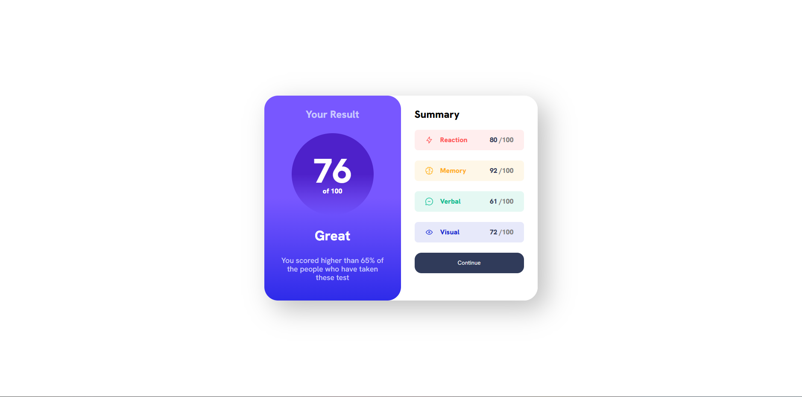

# Frontend Mentor - Results summary component solution

This is a solution to the [Results summary component challenge on Frontend Mentor](https://www.frontendmentor.io/challenges/results-summary-component-CE_K6s0maV). Frontend Mentor challenges help you improve your coding skills by building realistic projects. 

## Table of contents

- [Frontend Mentor - Results summary component solution](#frontend-mentor---results-summary-component-solution)
  - [Table of contents](#table-of-contents)
  - [Overview](#overview)
    - [The challenge](#the-challenge)
    - [Screenshot](#screenshot)
    - [Links](#links)
  - [My process](#my-process)
    - [Built with](#built-with)
    - [What I learned](#what-i-learned)
    - [Continued development](#continued-development)
    - [Useful resources](#useful-resources)
  - [Author](#author)
  

## Overview

### The challenge

Users should be able to:

- View the optimal layout for the interface depending on their device's screen size
- See hover and focus states for all interactive elements on the page
- **Bonus**: Use the local JSON data to dynamically populate the content

### Screenshot

### Links

- Solution URL: [Solution](https://github.com/Miller1999/ResultsSummaryComponent)
- Live Site URL: [Live Site](https://results-summary-component-delta-puce.vercel.app/)

## My process

### Built with

- [React](https://reactjs.org/) - JS library
- [Vite.js](https://vitejs.dev) - React framework
- [Styled Components](https://styled-components.com/) - For styles

### What I learned

This project has enabled me to refresh my understanding of fundamental tasks, such as importing JSON data, while also enhancing my proficiency with Styled-Components.

### Continued development

I employed minimal props drilling in this small project, as my primary aim was to concentrate on utilizing Context or Redux for future, more substantial projects

### Useful resources

- [Vite.js](https://vitejs.dev) - I chose to leverage this framework to boost my component's performance while also benefiting from its straightforward folder structure
- [Styled-Components](https://styled-components.com/docs) - I require this documentation to implement dynamic styling for my project.

## Author

- Website - [Miller Arias](https://portafolio-miller-arias.vercel.app)
- Frontend Mentor - [@Miller1999](https://www.frontendmentor.io/profile/Miller1999)
- Twitter - [@miller_arias](https://twitter.com/miller_arias)
- Github - [@Miller1999](https://github.com/Miller1999)

